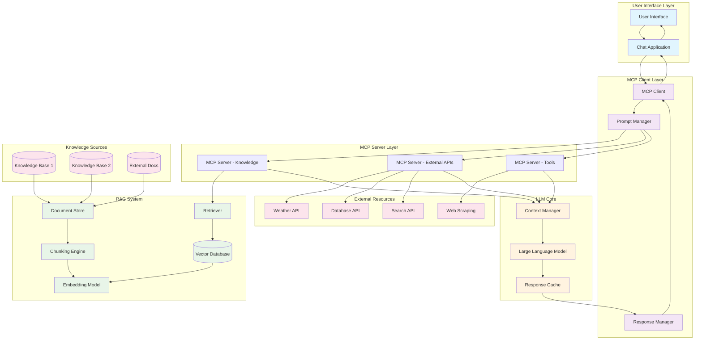

# llm

```mermaid

graph TB
    subgraph "User Interface Layer"
        UI[User Interface]
        Chat[Chat Application]
    end
    
    subgraph "MCP Client Layer"
        MCPC[MCP Client]
        PM[Prompt Manager]
        RM[Response Manager]
    end
    
    subgraph "MCP Server Layer"
        MCPS1[MCP Server - Knowledge]
        MCPS2[MCP Server - External APIs]
        MCPS3[MCP Server - Tools]
    end
    
    subgraph "RAG System"
        VDB[(Vector Database)]
        EMB[Embedding Model]
        RET[Retriever]
        DOC[Document Store]
        CHUNK[Chunking Engine]
    end
    
    subgraph "External Resources"
        API1[Weather API]
        API2[Database API]
        API3[Search API]
        WEB[Web Scraping]
    end
    
    subgraph "LLM Core"
        LLM[Large Language Model]
        CACHE[Response Cache]
        CTX[Context Manager]
    end
    
    subgraph "Knowledge Sources"
        KB1[(Knowledge Base 1)]
        KB2[(Knowledge Base 2)]
        KB3[(External Docs)]
    end
    
    %% User Flow
    UI --> Chat
    Chat --> MCPC
    
    %% MCP Client to Server Communication
    MCPC --> PM
    PM --> MCPS1
    PM --> MCPS2
    PM --> MCPS3
    
    %% RAG System Connections
    MCPS1 --> RET
    RET --> VDB
    VDB --> EMB
    DOC --> CHUNK
    CHUNK --> EMB
    KB1 --> DOC
    KB2 --> DOC
    KB3 --> DOC
    
    %% External API Connections
    MCPS2 --> API1
    MCPS2 --> API2
    MCPS2 --> API3
    MCPS3 --> WEB
    
    %% LLM Processing
    MCPS1 --> CTX
    MCPS2 --> CTX
    MCPS3 --> CTX
    CTX --> LLM
    LLM --> CACHE
    CACHE --> RM
    
    %% Response Flow
    RM --> MCPC
    MCPC --> Chat
    Chat --> UI
    
    %% Styling
    classDef userLayer fill:#e1f5fe
    classDef mcpLayer fill:#f3e5f5
    classDef ragLayer fill:#e8f5e8
    classDef llmLayer fill:#fff3e0
    classDef externalLayer fill:#fce4ec
    
    class UI,Chat userLayer
    class MCPC,PM,RM mcpLayer
    class VDB,EMB,RET,DOC,CHUNK ragLayer
    class LLM,CACHE,CTX llmLayer
    class API1,API2,API3,WEB,KB1,KB2,KB3 externalLayer
```
